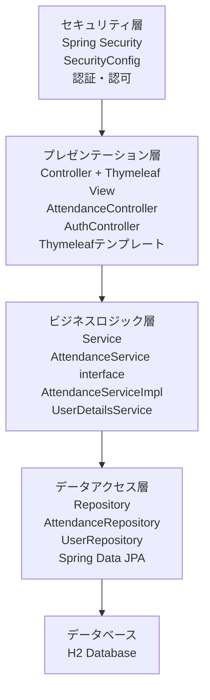
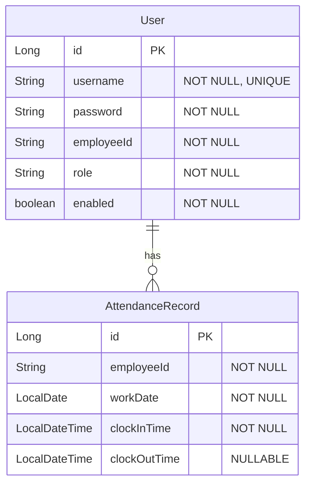
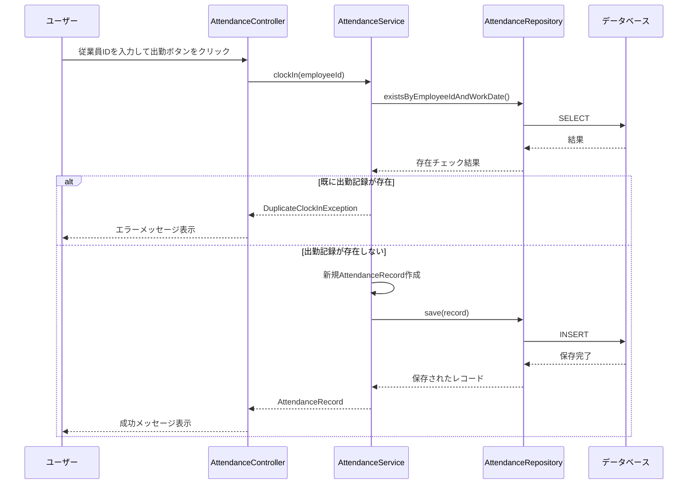
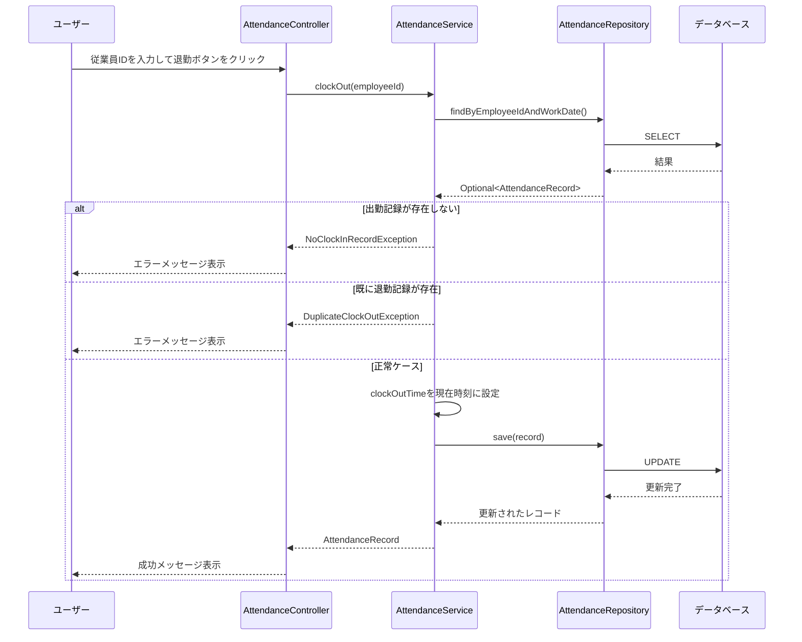
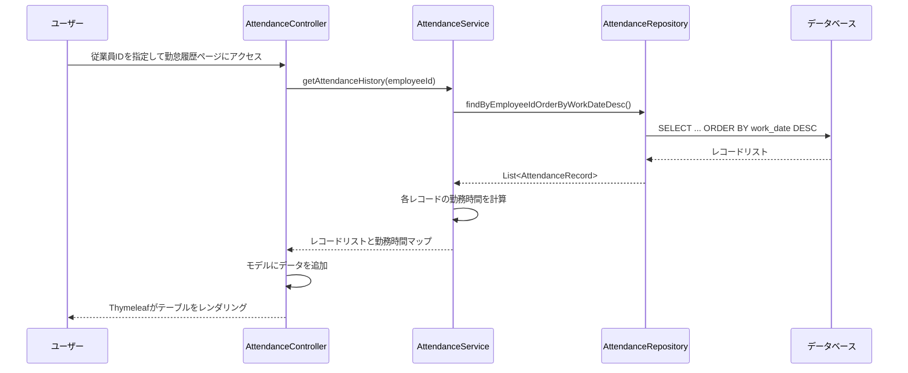
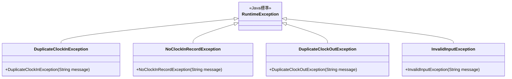

# 設計書

## 概要

本設計書は、Spring Boot初学者向けの勤怠管理アプリケーションの技術設計を定義します。このアプリケーションは、MVCアーキテクチャパターン、依存性注入（DI）、Bean管理などSpring Bootの基本概念を実践的に学ぶことを目的としています。

### 技術スタック

- **フレームワーク**: Spring Boot 3.x
- **ビルドツール**: Maven
- **データベース**: H2 Database（インメモリ/ファイルベース）
- **ORM**: Spring Data JPA
- **テンプレートエンジン**: Thymeleaf
- **セキュリティ**: Spring Security 6.x
- **Java バージョン**: Java 17以上

### 設計原則

1. **シンプルさ優先**: 初学者が理解しやすいよう、複雑な設計パターンは避ける
2. **MVCの明確な分離**: Controller、Service、Repositoryの責務を明確に分離
3. **Spring Bootの標準に従う**: アノテーションベースの設定を活用
4. **テスタビリティ**: Given-When-Then記法によるBDDアプローチでテスト可能な設計

## アーキテクチャ

### 3層アーキテクチャ



### レイヤー間の依存関係

- **Controller → Service**: コントローラはサービスインターフェースに依存
- **Service → Repository**: サービスはリポジトリインターフェースに依存
- **Repository → Entity**: リポジトリはエンティティクラスに依存

すべての依存関係はインターフェースを通じて行い、実装クラスはSpringのDIコンテナによって注入されます。

## コンポーネントとインターフェース

### 1. エンティティ層

#### AttendanceRecord（勤怠レコードエンティティ）

```java
@Entity
@Table(name = "attendance_records")
public class AttendanceRecord {
    @Id
    @GeneratedValue(strategy = GenerationType.IDENTITY)
    private Long id;
    
    @Column(nullable = false)
    private String employeeId;
    
    @Column(nullable = false)
    private LocalDate workDate;
    
    @Column(nullable = false)
    private LocalDateTime clockInTime;
    
    @Column
    private LocalDateTime clockOutTime;
    
    // コンストラクタ、ゲッター、セッター
}
```

**責務**:
- 勤怠データの構造を定義
- JPAエンティティとしてデータベーステーブルにマッピング
- 出勤時刻、退勤時刻、従業員IDなどの基本情報を保持

#### User（ユーザーエンティティ）

```java
@Entity
@Table(name = "users")
public class User {
    @Id
    @GeneratedValue(strategy = GenerationType.IDENTITY)
    private Long id;
    
    @Column(nullable = false, unique = true)
    private String username;
    
    @Column(nullable = false)
    private String password;
    
    @Column(nullable = false)
    private String employeeId;
    
    @Column(nullable = false)
    private String role; // ROLE_USER, ROLE_ADMIN
    
    @Column(nullable = false)
    private boolean enabled = true;
    
    // コンストラクタ、ゲッター、セッター
}
```

**責務**:
- ユーザー認証情報の構造を定義
- ユーザー名、パスワード、従業員ID、ロールを保持
- Spring Securityの認証に使用

### 2. リポジトリ層

#### AttendanceRepository（インターフェース）

```java
@Repository
public interface AttendanceRepository extends JpaRepository<AttendanceRecord, Long> {
    
    // 従業員IDで勤怠レコードを検索（日付降順）
    List<AttendanceRecord> findByEmployeeIdOrderByWorkDateDesc(String employeeId);
    
    // 従業員IDと勤務日で勤怠レコードを検索
    Optional<AttendanceRecord> findByEmployeeIdAndWorkDate(String employeeId, LocalDate workDate);
    
    // 従業員IDと勤務日で存在確認
    boolean existsByEmployeeIdAndWorkDate(String employeeId, LocalDate workDate);
}
```

**責務**:
- データベースへのCRUD操作を提供
- Spring Data JPAの機能を活用したクエリメソッド定義
- エンティティの永続化と取得

**Bean登録**: `@Repository`アノテーションにより自動的にSpring Beanとして登録

#### UserRepository（インターフェース）

```java
@Repository
public interface UserRepository extends JpaRepository<User, Long> {
    
    // ユーザー名でユーザーを検索
    Optional<User> findByUsername(String username);
    
    // 従業員IDでユーザーを検索
    Optional<User> findByEmployeeId(String employeeId);
    
    // ユーザー名の存在確認
    boolean existsByUsername(String username);
}
```

**責務**:
- ユーザー情報のCRUD操作を提供
- 認証時のユーザー検索
- ユーザー登録時の重複チェック

**Bean登録**: `@Repository`アノテーションにより自動的にSpring Beanとして登録

### 3. サービス層

#### AttendanceService（インターフェース）

```java
public interface AttendanceService {
    
    // 出勤記録を作成
    AttendanceRecord clockIn(String employeeId) throws DuplicateClockInException;
    
    // 退勤記録を更新
    AttendanceRecord clockOut(String employeeId) throws NoClockInRecordException, DuplicateClockOutException;
    
    // 従業員の勤怠履歴を取得
    List<AttendanceRecord> getAttendanceHistory(String employeeId);
    
    // 勤務時間を計算（時間単位）
    Duration calculateWorkingHours(AttendanceRecord record);
}
```

#### AttendanceServiceImpl（実装クラス）

```java
@Service
public class AttendanceServiceImpl implements AttendanceService {
    
    private final AttendanceRepository attendanceRepository;
    
    // コンストラクタインジェクション
    public AttendanceServiceImpl(AttendanceRepository attendanceRepository) {
        this.attendanceRepository = attendanceRepository;
    }
    
    @Override
    public AttendanceRecord clockIn(String employeeId) throws DuplicateClockInException {
        // 実装詳細は後述
    }
    
    @Override
    public AttendanceRecord clockOut(String employeeId) throws NoClockInRecordException, DuplicateClockOutException {
        // 実装詳細は後述
    }
    
    @Override
    public List<AttendanceRecord> getAttendanceHistory(String employeeId) {
        // 実装詳細は後述
    }
    
    @Override
    public Duration calculateWorkingHours(AttendanceRecord record) {
        // 実装詳細は後述
    }
}
```

**責務**:
- ビジネスロジックの実装
- バリデーションルールの適用
- トランザクション管理
- 例外ハンドリング

**Bean登録**: `@Service`アノテーションにより自動的にSpring Beanとして登録

**主要なビジネスロジック**:

1. **出勤記録（clockIn）**:
   - 現在日付で既に出勤記録が存在するかチェック
   - 存在する場合は`DuplicateClockInException`をスロー
   - 存在しない場合は新規レコードを作成し保存

2. **退勤記録（clockOut）**:
   - 当日の出勤記録が存在するかチェック
   - 存在しない場合は`NoClockInRecordException`をスロー
   - 既に退勤記録がある場合は`DuplicateClockOutException`をスロー
   - 退勤時刻を更新して保存

3. **勤怠履歴取得（getAttendanceHistory）**:
   - 従業員IDで勤怠レコードを検索
   - 日付降順でソートして返却

4. **勤務時間計算（calculateWorkingHours）**:
   - 出勤時刻と退勤時刻の差分を計算
   - 退勤時刻がnullの場合はnullを返却

#### CustomUserDetailsService（実装クラス）

```java
@Service
public class CustomUserDetailsService implements UserDetailsService {
    
    private final UserRepository userRepository;
    
    // コンストラクタインジェクション
    public CustomUserDetailsService(UserRepository userRepository) {
        this.userRepository = userRepository;
    }
    
    @Override
    public UserDetails loadUserByUsername(String username) throws UsernameNotFoundException {
        User user = userRepository.findByUsername(username)
            .orElseThrow(() -> new UsernameNotFoundException("ユーザーが見つかりません: " + username));
        
        return org.springframework.security.core.userdetails.User
            .withUsername(user.getUsername())
            .password(user.getPassword())
            .roles(user.getRole().replace("ROLE_", ""))
            .disabled(!user.isEnabled())
            .build();
    }
}
```

**責務**:
- Spring Securityの認証プロセスでユーザー情報を提供
- データベースからユーザーを検索
- UserDetailsオブジェクトに変換

**Bean登録**: `@Service`アノテーションにより自動的にSpring Beanとして登録

### 4. セキュリティ設定層

#### SecurityConfig

```java
@Configuration
@EnableWebSecurity
public class SecurityConfig {
    
    private final CustomUserDetailsService userDetailsService;
    
    // コンストラクタインジェクション
    public SecurityConfig(CustomUserDetailsService userDetailsService) {
        this.userDetailsService = userDetailsService;
    }
    
    @Bean
    public SecurityFilterChain filterChain(HttpSecurity http) throws Exception {
        http
            .authorizeHttpRequests(auth -> auth
                .requestMatchers("/login", "/register", "/css/**", "/h2-console/**").permitAll()
                .anyRequest().authenticated()
            )
            .formLogin(form -> form
                .loginPage("/login")
                .defaultSuccessUrl("/attendance/", true)
                .permitAll()
            )
            .logout(logout -> logout
                .logoutSuccessUrl("/login?logout")
                .permitAll()
            )
            .csrf(csrf -> csrf
                .ignoringRequestMatchers("/h2-console/**")
            )
            .headers(headers -> headers
                .frameOptions().sameOrigin() // H2コンソール用
            );
        
        return http.build();
    }
    
    @Bean
    public PasswordEncoder passwordEncoder() {
        return new BCryptPasswordEncoder();
    }
    
    @Bean
    public AuthenticationManager authenticationManager(
            AuthenticationConfiguration authenticationConfiguration) throws Exception {
        return authenticationConfiguration.getAuthenticationManager();
    }
}
```

**責務**:
- Spring Securityの設定を定義
- 認証・認可ルールの設定
- ログインページとログアウトの設定
- パスワードエンコーダーの提供

**Bean登録**: `@Configuration`アノテーションにより設定クラスとして登録

**セキュリティルール**:
- `/login`, `/register`, `/css/**`, `/h2-console/**`: 認証不要
- その他すべてのパス: 認証必須
- ログイン成功後は`/attendance/`にリダイレクト

### 5. コントローラ層

#### AttendanceController

```java
@Controller
@RequestMapping("/attendance")
public class AttendanceController {
    
    private final AttendanceService attendanceService;
    private final UserRepository userRepository;
    
    // コンストラクタインジェクション
    public AttendanceController(AttendanceService attendanceService, UserRepository userRepository) {
        this.attendanceService = attendanceService;
        this.userRepository = userRepository;
    }
    
    // ホームページ表示
    @GetMapping("/")
    public String home(Principal principal, Model model) {
        // ログインユーザーの従業員IDを取得
        String username = principal.getName();
        User user = userRepository.findByUsername(username).orElseThrow();
        model.addAttribute("employeeId", user.getEmployeeId());
        return "home";
    }
    
    // 出勤処理
    @PostMapping("/clock-in")
    public String clockIn(Principal principal, RedirectAttributes redirectAttributes) {
        // ログインユーザーの従業員IDを使用
        String username = principal.getName();
        User user = userRepository.findByUsername(username).orElseThrow();
        // 実装詳細は後述
    }
    
    // 退勤処理
    @PostMapping("/clock-out")
    public String clockOut(Principal principal, RedirectAttributes redirectAttributes) {
        // ログインユーザーの従業員IDを使用
        String username = principal.getName();
        User user = userRepository.findByUsername(username).orElseThrow();
        // 実装詳細は後述
    }
    
    // 勤怠履歴表示
    @GetMapping("/history")
    public String history(Principal principal, Model model) {
        // ログインユーザーの従業員IDを使用
        String username = principal.getName();
        User user = userRepository.findByUsername(username).orElseThrow();
        // 実装詳細は後述
    }
}
```

**責務**:
- HTTPリクエストの受信と処理
- サービス層の呼び出し
- ビューへのデータ渡し
- リダイレクトとフラッシュメッセージの管理

**Bean登録**: `@Controller`アノテーションにより自動的にSpring Beanとして登録

**エンドポイント**:

1. `GET /attendance/` - ホームページ表示
2. `POST /attendance/clock-in` - 出勤記録
3. `POST /attendance/clock-out` - 退勤記録
4. `GET /attendance/history` - 勤怠履歴表示

#### AuthController

```java
@Controller
public class AuthController {
    
    private final UserRepository userRepository;
    private final PasswordEncoder passwordEncoder;
    
    // コンストラクタインジェクション
    public AuthController(UserRepository userRepository, PasswordEncoder passwordEncoder) {
        this.userRepository = userRepository;
        this.passwordEncoder = passwordEncoder;
    }
    
    // ログインページ表示
    @GetMapping("/login")
    public String login() {
        return "login";
    }
    
    // ユーザー登録ページ表示
    @GetMapping("/register")
    public String registerForm() {
        return "register";
    }
    
    // ユーザー登録処理
    @PostMapping("/register")
    public String register(
        @RequestParam String username,
        @RequestParam String password,
        @RequestParam String employeeId,
        RedirectAttributes redirectAttributes
    ) {
        // 実装詳細は後述
    }
}
```

**責務**:
- ログイン・ログアウトページの表示
- ユーザー登録処理
- 認証エラーメッセージの表示

**Bean登録**: `@Controller`アノテーションにより自動的にSpring Beanとして登録

**エンドポイント**:

1. `GET /login` - ログインページ表示
2. `GET /register` - ユーザー登録ページ表示
3. `POST /register` - ユーザー登録処理

### 6. 例外クラス

#### カスタム例外

```java
// 重複出勤例外
public class DuplicateClockInException extends RuntimeException {
    public DuplicateClockInException(String message) {
        super(message);
    }
}

// 出勤記録なし例外
public class NoClockInRecordException extends RuntimeException {
    public NoClockInRecordException(String message) {
        super(message);
    }
}

// 重複退勤例外
public class DuplicateClockOutException extends RuntimeException {
    public DuplicateClockOutException(String message) {
        super(message);
    }
}

// 不正な入力例外
public class InvalidInputException extends RuntimeException {
    public InvalidInputException(String message) {
        super(message);
    }
}
```

**責務**:
- ビジネスルール違反を明示的に表現
- エラーハンドリングの一元化を支援

### 7. ビュー層（Thymeleaf）

#### home.html（ホームページ）

```html
<!DOCTYPE html>
<html xmlns:th="http://www.thymeleaf.org">
<head>
    <title>勤怠管理システム</title>
</head>
<body>
    <h1>勤怠管理システム</h1>
    
    <p>ログイン中: <span th:text="${employeeId}"></span></p>
    
    <!-- 成功メッセージ -->
    <div th:if="${successMessage}" th:text="${successMessage}"></div>
    
    <!-- エラーメッセージ -->
    <div th:if="${errorMessage}" th:text="${errorMessage}"></div>
    
    <!-- 出勤・退勤ボタン -->
    <form>
        <!-- 出勤ボタン -->
        <button type="submit" formaction="/attendance/clock-in" formmethod="post">出勤</button>
        
        <!-- 退勤ボタン -->
        <button type="submit" formaction="/attendance/clock-out" formmethod="post">退勤</button>
    </form>
    
    <!-- 勤怠履歴リンク -->
    <p><a href="/attendance/history">勤怠履歴を見る</a></p>
    
    <!-- ログアウトフォーム -->
    <form th:action="@{/logout}" method="post">
        <button type="submit">ログアウト</button>
    </form>
</body>
</html>
```

#### history.html（勤怠履歴ページ）

```html
<!DOCTYPE html>
<html xmlns:th="http://www.thymeleaf.org">
<head>
    <title>勤怠履歴</title>
</head>
<body>
    <h1>勤怠履歴</h1>
    
    <!-- 勤怠レコードがない場合 -->
    <div th:if="${#lists.isEmpty(records)}">
        <p>勤怠記録がありません</p>
    </div>
    
    <!-- 勤怠レコードテーブル -->
    <table th:unless="${#lists.isEmpty(records)}">
        <thead>
            <tr>
                <th>日付</th>
                <th>出勤時刻</th>
                <th>退勤時刻</th>
                <th>勤務時間</th>
            </tr>
        </thead>
        <tbody>
            <tr th:each="record : ${records}">
                <td th:text="${record.workDate}"></td>
                <td th:text="${record.clockInTime}"></td>
                <td th:text="${record.clockOutTime != null ? record.clockOutTime : '未退勤'}"></td>
                <td th:text="${workingHours.get(record.id)}"></td>
            </tr>
        </tbody>
    </table>
    
    <p><a href="/attendance/">ホームに戻る</a></p>
    
    <!-- ログアウトフォーム -->
    <form th:action="@{/logout}" method="post">
        <button type="submit">ログアウト</button>
    </form>
</body>
</html>
```

**責務**:
- ユーザーインターフェースの提供
- データの表示
- フォーム入力の受付

#### login.html（ログインページ）

```html
<!DOCTYPE html>
<html xmlns:th="http://www.thymeleaf.org">
<head>
    <title>ログイン - 勤怠管理システム</title>
</head>
<body>
    <h1>ログイン</h1>
    
    <!-- エラーメッセージ -->
    <div th:if="${param.error}">
        <p style="color: red;">ユーザー名またはパスワードが正しくありません</p>
    </div>
    
    <!-- ログアウトメッセージ -->
    <div th:if="${param.logout}">
        <p style="color: green;">ログアウトしました</p>
    </div>
    
    <!-- ログインフォーム -->
    <form th:action="@{/login}" method="post">
        <div>
            <label>ユーザー名: <input type="text" name="username" required /></label>
        </div>
        <div>
            <label>パスワード: <input type="password" name="password" required /></label>
        </div>
        <button type="submit">ログイン</button>
    </form>
    
    <p><a href="/register">新規ユーザー登録</a></p>
</body>
</html>
```

#### register.html（ユーザー登録ページ）

```html
<!DOCTYPE html>
<html xmlns:th="http://www.thymeleaf.org">
<head>
    <title>ユーザー登録 - 勤怠管理システム</title>
</head>
<body>
    <h1>ユーザー登録</h1>
    
    <!-- エラーメッセージ -->
    <div th:if="${errorMessage}" th:text="${errorMessage}" style="color: red;"></div>
    
    <!-- 登録フォーム -->
    <form th:action="@{/register}" method="post">
        <div>
            <label>ユーザー名: <input type="text" name="username" required /></label>
        </div>
        <div>
            <label>パスワード: <input type="password" name="password" required /></label>
        </div>
        <div>
            <label>従業員ID: <input type="text" name="employeeId" required /></label>
        </div>
        <button type="submit">登録</button>
    </form>
    
    <p><a href="/login">ログインページに戻る</a></p>
</body>
</html>
```

## データモデル

### エンティティ関係図（ER図）



### データベーステーブル定義

#### users テーブル

| カラム名 | データ型 | 制約 | 説明 |
|---------|---------|------|------|
| id | BIGINT | PRIMARY KEY, AUTO_INCREMENT | 主キー |
| username | VARCHAR(50) | NOT NULL, UNIQUE | ユーザー名 |
| password | VARCHAR(255) | NOT NULL | パスワード（BCrypt暗号化） |
| employee_id | VARCHAR(50) | NOT NULL | 従業員ID |
| role | VARCHAR(20) | NOT NULL | ロール（ROLE_USER, ROLE_ADMIN） |
| enabled | BOOLEAN | NOT NULL, DEFAULT TRUE | アカウント有効フラグ |

**インデックス**:
- `idx_username`: (username) - ログイン時の検索パフォーマンス向上
- `idx_employee_id`: (employee_id) - 従業員IDでの検索用

#### attendance_records テーブル

| カラム名 | データ型 | 制約 | 説明 |
|---------|---------|------|------|
| id | BIGINT | PRIMARY KEY, AUTO_INCREMENT | 主キー |
| employee_id | VARCHAR(50) | NOT NULL | 従業員ID |
| work_date | DATE | NOT NULL | 勤務日 |
| clock_in_time | TIMESTAMP | NOT NULL | 出勤時刻 |
| clock_out_time | TIMESTAMP | NULL | 退勤時刻 |

**インデックス**:
- `idx_employee_date`: (employee_id, work_date) - 検索パフォーマンス向上のため

**制約**:
- UNIQUE制約: (employee_id, work_date) - 1日1レコードを保証

### データフロー

#### 出勤記録のフロー



#### 退勤記録のフロー



#### 勤怠履歴表示のフロー




## 正確性プロパティ

プロパティとは、システムのすべての有効な実行において真であるべき特性や振る舞いのことです。本質的には、システムが何をすべきかについての形式的な記述です。プロパティは、人間が読める仕様と機械で検証可能な正確性保証との橋渡しをします。

以下のプロパティは、要件定義書の受け入れ基準から導出され、プロパティベーステスト（PBT）によって検証されます。

### プロパティ1: 出勤記録の作成と完全性

**任意の**従業員IDに対して、出勤処理を実行すると、システムは以下を満たす勤怠レコードを作成する：
- 従業員IDが正しく記録される
- 勤務日が現在日付である
- 出勤時刻が現在時刻の近似値である（±数秒以内）
- 退勤時刻がnullである

**検証: 要件 1.1, 1.2**

### プロパティ2: 重複出勤の防止

**任意の**従業員IDと日付に対して、同じ日に2回目の出勤処理を実行すると、システムは`DuplicateClockInException`をスローし、データベースには1つの勤怠レコードのみが存在する。

**検証: 要件 1.4**

### プロパティ3: 退勤記録の更新

**任意の**従業員IDに対して、出勤後に退勤処理を実行すると、システムは以下を満たす：
- 同じ勤怠レコードが更新される（新規レコードは作成されない）
- 退勤時刻が現在時刻の近似値である（±数秒以内）
- 出勤時刻は変更されない

**検証: 要件 2.1, 2.2**

### プロパティ4: 出勤記録なしでの退勤拒否

**任意の**従業員IDに対して、出勤記録が存在しない状態で退勤処理を実行すると、システムは`NoClockInRecordException`をスローする。

**検証: 要件 2.4**

### プロパティ5: 重複退勤の防止

**任意の**従業員IDに対して、出勤・退勤後に2回目の退勤処理を実行すると、システムは`DuplicateClockOutException`をスローし、退勤時刻は最初の値のまま変更されない。

**検証: 要件 2.5**

### プロパティ6: 勤怠履歴の日付降順ソート

**任意の**従業員IDに対して、複数の勤怠レコードが存在する場合、勤怠履歴を取得すると、システムは日付降順（新しい順）でソートされたリストを返す。

**検証: 要件 3.1**

### プロパティ7: 勤怠履歴の完全性

**任意の**従業員IDに対して、勤怠履歴を取得すると、返される各レコードには以下の情報が含まれる：
- 勤務日
- 出勤時刻
- 退勤時刻（またはnull）

**検証: 要件 3.2**

### プロパティ8: 勤務時間の正確な計算

**任意の**出勤時刻と退勤時刻を持つ勤怠レコードに対して、勤務時間を計算すると、システムは退勤時刻から出勤時刻を減算した正確な時間差（Duration）を返す。

**検証: 要件 4.1, 4.2**

### プロパティ9: 勤務時間の表示フォーマット

**任意の**Durationオブジェクトに対して、表示用にフォーマットすると、システムは「X時間Y分」の形式の文字列を返す。

**検証: 要件 4.3**

### プロパティ10: データ永続化のラウンドトリップ

**任意の**勤怠レコードに対して、保存してから同じ従業員IDと日付で取得すると、システムは元のレコードと同等のデータを返す（idを除く）。

**検証: 要件 5.1**

### プロパティ11: ビジネスルール違反時の例外スロー

**任意の**ビジネスルール違反（重複出勤、出勤記録なしでの退勤、重複退勤）に対して、システムは適切なカスタム例外をスローする。

**検証: 要件 8.1**

### プロパティ12: エラーメッセージの伝達

**任意の**例外が発生した場合、コントローラはエラーメッセージをモデルに追加し、ビューに渡す。

**検証: 要件 8.4**

### プロパティ13: 従業員ID必須バリデーション

**任意の**操作（出勤、退勤、履歴取得）に対して、従業員IDがnullまたは空文字列の場合、システムは`InvalidInputException`をスローする。

**検証: 要件 9.1**

### プロパティ14: パスワードの暗号化

**任意の**ユーザー登録時に、システムはパスワードをBCryptアルゴリズムで暗号化して保存する。平文パスワードはデータベースに保存されない。

**検証: 要件 13.1, 13.2**

### プロパティ15: 認証されたユーザーのみアクセス可能

**任意の**勤怠管理機能（出勤、退勤、履歴表示）に対して、認証されていないユーザーがアクセスすると、システムはログインページにリダイレクトする。

**検証: 要件 11.4**

### プロパティ16: ユーザー名の一意性

**任意の**ユーザー登録時に、既に存在するユーザー名で登録しようとすると、システムはエラーメッセージを表示し、登録を拒否する。

**検証: 要件 12.3**

### プロパティ17: ログインユーザーに基づく勤怠記録

**任意の**ログインユーザーに対して、出勤・退勤・履歴表示の操作は、そのユーザーに紐づく従業員IDを使用して実行される。

**検証: 要件 15.1, 15.2, 15.3**

### エッジケース

以下のエッジケースは、プロパティベーステストのジェネレータで適切に処理されることを確認します：

- **退勤時刻がnullの勤怠レコード**: 表示時に「未退勤」と表示される（要件 3.3）
- **勤怠履歴が空のリスト**: 「勤怠記録がありません」と表示される（要件 3.4）
- **退勤時刻がnullの場合の勤務時間計算**: nullまたは計算しない（要件 4.4）

## エラーハンドリング

### 例外階層



### エラーハンドリング戦略

#### 1. サービス層での例外スロー

サービス層は、ビジネスルール違反を検出した際にカスタム例外をスローします。

```java
@Override
public AttendanceRecord clockIn(String employeeId) throws DuplicateClockInException {
    // 入力バリデーション
    validateEmployeeId(employeeId);
    
    LocalDate today = LocalDate.now();
    
    // 重複チェック
    if (attendanceRepository.existsByEmployeeIdAndWorkDate(employeeId, today)) {
        throw new DuplicateClockInException(
            "従業員ID " + employeeId + " は本日既に出勤記録があります"
        );
    }
    
    // 新規レコード作成
    AttendanceRecord record = new AttendanceRecord();
    record.setEmployeeId(employeeId);
    record.setWorkDate(today);
    record.setClockInTime(LocalDateTime.now());
    
    return attendanceRepository.save(record);
}
```

#### 2. コントローラ層での例外キャッチ

コントローラは、サービス層からの例外をキャッチし、ユーザーフレンドリーなエラーメッセージをビューに渡します。

```java
@PostMapping("/clock-in")
public String clockIn(@RequestParam String employeeId, RedirectAttributes redirectAttributes) {
    try {
        attendanceService.clockIn(employeeId);
        redirectAttributes.addFlashAttribute("successMessage", "出勤を記録しました");
        return "redirect:/attendance/";
    } catch (DuplicateClockInException e) {
        redirectAttributes.addFlashAttribute("errorMessage", e.getMessage());
        return "redirect:/attendance/";
    } catch (InvalidInputException e) {
        redirectAttributes.addFlashAttribute("errorMessage", e.getMessage());
        return "redirect:/attendance/";
    } catch (Exception e) {
        redirectAttributes.addFlashAttribute("errorMessage", "システムエラーが発生しました");
        return "redirect:/attendance/";
    }
}
```

#### 3. グローバル例外ハンドラ（オプション）

より高度なエラーハンドリングのために、`@ControllerAdvice`を使用したグローバル例外ハンドラを実装することもできます。

```java
@ControllerAdvice
public class GlobalExceptionHandler {
    
    @ExceptionHandler(DuplicateClockInException.class)
    public String handleDuplicateClockIn(DuplicateClockInException e, RedirectAttributes redirectAttributes) {
        redirectAttributes.addFlashAttribute("errorMessage", e.getMessage());
        return "redirect:/attendance/";
    }
    
    @ExceptionHandler(Exception.class)
    public String handleGenericException(Exception e, RedirectAttributes redirectAttributes) {
        redirectAttributes.addFlashAttribute("errorMessage", "システムエラーが発生しました");
        return "redirect:/attendance/";
    }
}
```

### エラーメッセージの設計原則

1. **ユーザーフレンドリー**: 技術的な詳細を避け、ユーザーが理解できる言葉を使用
2. **具体的**: 何が問題で、どうすればよいかを明確に伝える
3. **一貫性**: 同じ種類のエラーには同じフォーマットを使用
4. **セキュリティ**: データベースエラーなどの内部情報を露出しない

## テスト戦略

### デュアルテストアプローチ

本アプリケーションでは、以下の2つの補完的なテスト手法を採用します：

1. **ユニットテスト**: 特定の例、エッジケース、エラー条件を検証
2. **プロパティベーステスト（PBT）**: すべての入力に対して普遍的なプロパティを検証

両方のアプローチを組み合わせることで、包括的なテストカバレッジを実現します。

### プロパティベーステスト（PBT）

#### 使用ライブラリ

- **jqwik**: Java用のプロパティベーステストライブラリ
- Maven依存関係:
  ```xml
  <dependency>
      <groupId>net.jqwik</groupId>
      <artifactId>jqwik</artifactId>
      <version>1.7.4</version>
      <scope>test</scope>
  </dependency>
  ```

#### PBT設定

- **イテレーション数**: 各プロパティテストは最低100回実行
- **タグ付け**: 各テストには設計書のプロパティ番号を参照するコメントを付与
- **タグフォーマット**: `// Feature: attendance-management, Property N: [プロパティ説明]`

#### PBTテスト例

```java
@Property
// Feature: attendance-management, Property 1: 出勤記録の作成と完全性
void clockInCreatesCompleteRecord(@ForAll @AlphaChars @StringLength(min = 1, max = 10) String employeeId) {
    // Given: サービスとリポジトリのセットアップ
    AttendanceService service = new AttendanceServiceImpl(repository);
    LocalDateTime beforeClockIn = LocalDateTime.now();
    
    // When: 出勤処理を実行
    AttendanceRecord record = service.clockIn(employeeId);
    LocalDateTime afterClockIn = LocalDateTime.now();
    
    // Then: レコードが完全であることを検証
    assertThat(record.getEmployeeId()).isEqualTo(employeeId);
    assertThat(record.getWorkDate()).isEqualTo(LocalDate.now());
    assertThat(record.getClockInTime()).isBetween(beforeClockIn, afterClockIn);
    assertThat(record.getClockOutTime()).isNull();
}

@Property
// Feature: attendance-management, Property 2: 重複出勤の防止
void duplicateClockInThrowsException(@ForAll @AlphaChars @StringLength(min = 1, max = 10) String employeeId) {
    // Given: 既に出勤記録が存在する
    AttendanceService service = new AttendanceServiceImpl(repository);
    service.clockIn(employeeId);
    
    // When & Then: 2回目の出勤は例外をスロー
    assertThatThrownBy(() -> service.clockIn(employeeId))
        .isInstanceOf(DuplicateClockInException.class)
        .hasMessageContaining("既に出勤記録があります");
}

@Property
// Feature: attendance-management, Property 8: 勤務時間の正確な計算
void workingHoursCalculationIsAccurate(
    @ForAll @IntRange(min = 0, max = 23) int startHour,
    @ForAll @IntRange(min = 0, max = 59) int startMinute,
    @ForAll @IntRange(min = 1, max = 12) int workHours
) {
    // Given: 出勤時刻と退勤時刻を持つレコード
    LocalDateTime clockIn = LocalDateTime.of(2024, 1, 1, startHour, startMinute);
    LocalDateTime clockOut = clockIn.plusHours(workHours);
    
    AttendanceRecord record = new AttendanceRecord();
    record.setClockInTime(clockIn);
    record.setClockOutTime(clockOut);
    
    // When: 勤務時間を計算
    Duration duration = service.calculateWorkingHours(record);
    
    // Then: 正確な時間差が返される
    assertThat(duration.toHours()).isEqualTo(workHours);
}
```

### ユニットテスト

#### 使用ライブラリ

- **JUnit 5**: テストフレームワーク
- **Mockito**: モックライブラリ
- **AssertJ**: アサーションライブラリ

#### ユニットテストの焦点

ユニットテストは以下に焦点を当てます：

1. **特定の例**: 典型的な使用シナリオの検証
2. **エッジケース**: 境界値、null値、空のリストなど
3. **エラー条件**: 例外がスローされる具体的なケース
4. **統合ポイント**: コンポーネント間の連携

#### ユニットテスト例

```java
@Test
@DisplayName("退勤時刻がnullの場合、勤務時間はnullを返す")
void calculateWorkingHours_WithNullClockOut_ReturnsNull() {
    // Given: 退勤時刻がnullのレコード
    AttendanceRecord record = new AttendanceRecord();
    record.setClockInTime(LocalDateTime.now());
    record.setClockOutTime(null);
    
    // When: 勤務時間を計算
    Duration duration = service.calculateWorkingHours(record);
    
    // Then: nullが返される
    assertThat(duration).isNull();
}

@Test
@DisplayName("勤怠履歴が空の場合、空のリストを返す")
void getAttendanceHistory_WithNoRecords_ReturnsEmptyList() {
    // Given: 勤怠レコードが存在しない従業員
    String employeeId = "EMP999";
    when(repository.findByEmployeeIdOrderByWorkDateDesc(employeeId))
        .thenReturn(Collections.emptyList());
    
    // When: 勤怠履歴を取得
    List<AttendanceRecord> history = service.getAttendanceHistory(employeeId);
    
    // Then: 空のリストが返される
    assertThat(history).isEmpty();
}

@Test
@DisplayName("従業員IDがnullの場合、InvalidInputExceptionをスロー")
void clockIn_WithNullEmployeeId_ThrowsException() {
    // When & Then: null従業員IDで出勤すると例外
    assertThatThrownBy(() -> service.clockIn(null))
        .isInstanceOf(InvalidInputException.class)
        .hasMessageContaining("従業員IDは必須です");
}
```

### 統合テスト

統合テストは、Spring Bootの`@SpringBootTest`を使用して、実際のアプリケーションコンテキストで実行します。

```java
@SpringBootTest
@AutoConfigureTestDatabase
class AttendanceIntegrationTest {
    
    @Autowired
    private AttendanceService attendanceService;
    
    @Autowired
    private AttendanceRepository attendanceRepository;
    
    @BeforeEach
    void setUp() {
        attendanceRepository.deleteAll();
    }
    
    @Test
    @DisplayName("出勤から退勤までの完全なフロー")
    void completeAttendanceFlow() {
        // Given: 従業員ID
        String employeeId = "EMP001";
        
        // When: 出勤
        AttendanceRecord clockInRecord = attendanceService.clockIn(employeeId);
        
        // Then: 出勤記録が作成される
        assertThat(clockInRecord.getClockInTime()).isNotNull();
        assertThat(clockInRecord.getClockOutTime()).isNull();
        
        // When: 退勤
        AttendanceRecord clockOutRecord = attendanceService.clockOut(employeeId);
        
        // Then: 同じレコードが更新される
        assertThat(clockOutRecord.getId()).isEqualTo(clockInRecord.getId());
        assertThat(clockOutRecord.getClockOutTime()).isNotNull();
        
        // When: 勤怠履歴を取得
        List<AttendanceRecord> history = attendanceService.getAttendanceHistory(employeeId);
        
        // Then: 1件のレコードが存在
        assertThat(history).hasSize(1);
        assertThat(history.get(0).getId()).isEqualTo(clockInRecord.getId());
    }
}
```

### テストカバレッジ目標

- **ライン カバレッジ**: 80%以上
- **ブランチ カバレッジ**: 75%以上
- **重要なビジネスロジック**: 100%

### BDD（振る舞い駆動開発）アプローチ

すべてのテストは、Given-When-Then記法を使用して記述します：

- **Given（前提条件）**: テストの初期状態をセットアップ
- **When（実行）**: テスト対象の操作を実行
- **Then（検証）**: 期待される結果を検証

この記法により、テストの意図が明確になり、要件との対応関係が理解しやすくなります。

## 実装の補足事項

### データベース設定

#### application.properties

```properties
# H2 Database設定
spring.datasource.url=jdbc:h2:file:./data/attendance
spring.datasource.driverClassName=org.h2.Driver
spring.datasource.username=sa
spring.datasource.password=

# JPA設定
spring.jpa.database-platform=org.hibernate.dialect.H2Dialect
spring.jpa.hibernate.ddl-auto=update
spring.jpa.show-sql=true

# H2 Console（開発用）
spring.h2.console.enabled=true
spring.h2.console.path=/h2-console

# Thymeleaf設定
spring.thymeleaf.cache=false
```

### プロジェクト構造

```
src/
├── main/
│   ├── java/
│   │   └── com/
│   │       └── example/
│   │           └── attendance/
│   │               ├── AttendanceApplication.java
│   │               ├── controller/
│   │               │   ├── AttendanceController.java
│   │               │   └── AuthController.java
│   │               ├── service/
│   │               │   ├── AttendanceService.java
│   │               │   ├── AttendanceServiceImpl.java
│   │               │   └── CustomUserDetailsService.java
│   │               ├── repository/
│   │               │   ├── AttendanceRepository.java
│   │               │   └── UserRepository.java
│   │               ├── entity/
│   │               │   ├── AttendanceRecord.java
│   │               │   └── User.java
│   │               ├── config/
│   │               │   └── SecurityConfig.java
│   │               └── exception/
│   │                   ├── DuplicateClockInException.java
│   │                   ├── NoClockInRecordException.java
│   │                   ├── DuplicateClockOutException.java
│   │                   └── InvalidInputException.java
│   └── resources/
│       ├── application.properties
│       └── templates/
│           ├── login.html
│           ├── register.html
│           ├── home.html
│           └── history.html
└── test/
    └── java/
        └── com/
            └── example/
                └── attendance/
                    ├── service/
                    │   ├── AttendanceServiceTest.java
                    │   └── AttendanceServicePropertyTest.java
                    ├── controller/
                    │   ├── AttendanceControllerTest.java
                    │   └── AuthControllerTest.java
                    ├── security/
                    │   └── SecurityConfigTest.java
                    └── integration/
                        └── AttendanceIntegrationTest.java
```

### Maven依存関係

```xml
<dependencies>
    <!-- Spring Boot Starter Web -->
    <dependency>
        <groupId>org.springframework.boot</groupId>
        <artifactId>spring-boot-starter-web</artifactId>
    </dependency>
    
    <!-- Spring Boot Starter Data JPA -->
    <dependency>
        <groupId>org.springframework.boot</groupId>
        <artifactId>spring-boot-starter-data-jpa</artifactId>
    </dependency>
    
    <!-- Spring Boot Starter Thymeleaf -->
    <dependency>
        <groupId>org.springframework.boot</groupId>
        <artifactId>spring-boot-starter-thymeleaf</artifactId>
    </dependency>
    
    <!-- Spring Boot Starter Security -->
    <dependency>
        <groupId>org.springframework.boot</groupId>
        <artifactId>spring-boot-starter-security</artifactId>
    </dependency>
    
    <!-- Thymeleaf Spring Security Integration -->
    <dependency>
        <groupId>org.thymeleaf.extras</groupId>
        <artifactId>thymeleaf-extras-springsecurity6</artifactId>
    </dependency>
    
    <!-- H2 Database -->
    <dependency>
        <groupId>com.h2database</groupId>
        <artifactId>h2</artifactId>
        <scope>runtime</scope>
    </dependency>
    
    <!-- Spring Boot Starter Test -->
    <dependency>
        <groupId>org.springframework.boot</groupId>
        <artifactId>spring-boot-starter-test</artifactId>
        <scope>test</scope>
    </dependency>
    
    <!-- Spring Security Test -->
    <dependency>
        <groupId>org.springframework.security</groupId>
        <artifactId>spring-security-test</artifactId>
        <scope>test</scope>
    </dependency>
    
    <!-- jqwik for Property-Based Testing -->
    <dependency>
        <groupId>net.jqwik</groupId>
        <artifactId>jqwik</artifactId>
        <version>1.7.4</version>
        <scope>test</scope>
    </dependency>
</dependencies>
```

### 学習ポイント

この設計を通じて、Spring Boot初学者は以下の概念を学ぶことができます：

1. **MVCアーキテクチャ**: Controller、Service、Repositoryの役割分担
2. **依存性注入（DI）**: コンストラクタインジェクションによる疎結合
3. **Bean管理**: Spring DIコンテナによる自動Bean登録
4. **Spring Data JPA**: リポジトリパターンとクエリメソッド
5. **Thymeleaf**: サーバーサイドテンプレートエンジン
6. **Spring Security**: 認証・認可の実装
7. **パスワード暗号化**: BCryptPasswordEncoderの使用
8. **例外ハンドリング**: カスタム例外とエラーメッセージの伝達
9. **テスト駆動開発**: ユニットテストとプロパティベーステスト
10. **BDD**: Given-When-Then記法による振る舞い駆動開発
11. **セキュリティテスト**: Spring Security Testを使用した認証テスト

