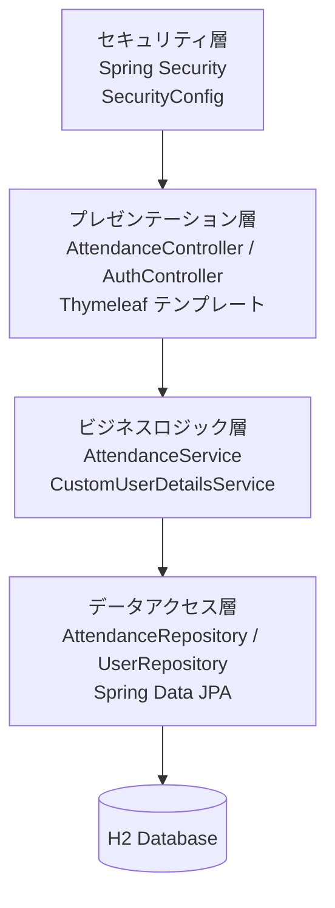
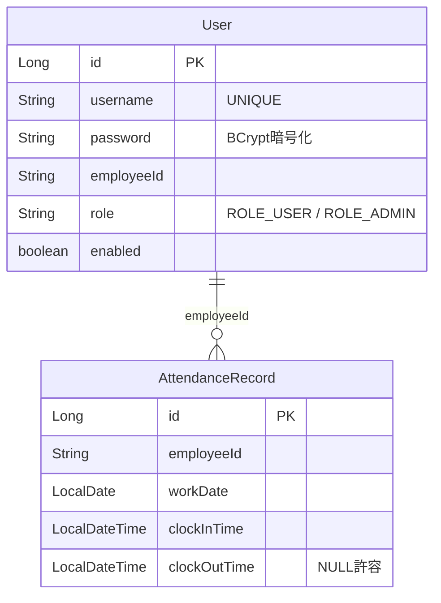
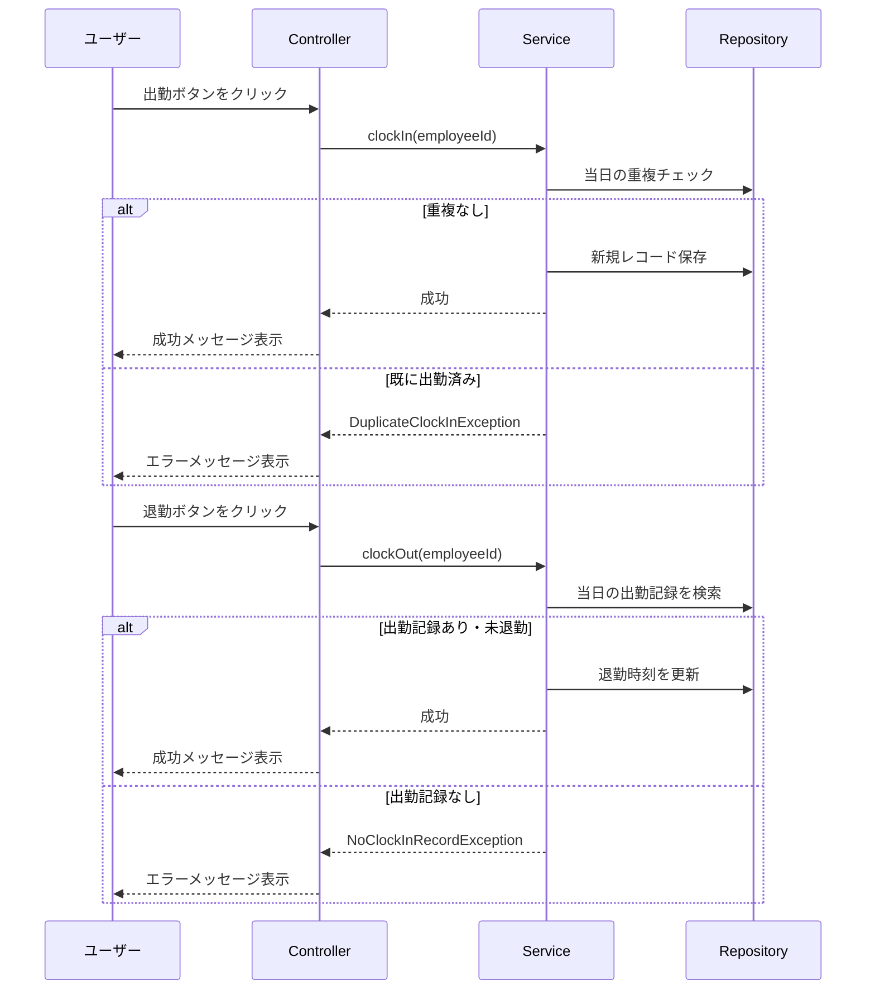

# Chronolog

Spring Boot 初学者向けの勤怠管理アプリケーションです。
MVC パターン、依存性注入（DI）、Bean 管理など Spring Boot の基本概念を実践的に学ぶことを目的としています。

## 技術スタック

| カテゴリ | 技術 |
|---------|------|
| フレームワーク | Spring Boot 3.x |
| ビルドツール | Maven |
| 言語 | Java 17+ |
| データベース | H2 Database（ファイルベース） |
| ORM | Spring Data JPA |
| テンプレートエンジン | Thymeleaf |
| セキュリティ | Spring Security 6.x |
| テスト | JUnit 5 / Mockito / AssertJ / jqwik（PBT） |

## 主な機能

- **ユーザー認証** - ユーザー登録・ログイン・ログアウト（Spring Security / BCrypt）
- **出勤記録** - ボタンクリックで現在時刻を出勤時刻として記録
- **退勤記録** - ボタンクリックで現在時刻を退勤時刻として記録
- **勤怠履歴** - 自分の勤怠レコードを日付降順で一覧表示
- **勤務時間計算** - 出勤・退勤時刻から勤務時間を自動計算（X時間Y分形式）
- **バリデーション** - 重複出勤/退勤の防止、出勤記録なしでの退勤拒否

## アーキテクチャ

3 層アーキテクチャ（MVC）を採用し、各レイヤーはインターフェースを介してコンストラクタインジェクションで接続されます。



## データモデル



## 主要フロー

### 出勤・退勤フロー



## プロジェクト構成

```
src/
├── main/
│   ├── java/com/example/attendance/
│   │   ├── controller/    # AttendanceController, AuthController
│   │   ├── service/       # AttendanceService, CustomUserDetailsService
│   │   ├── repository/    # AttendanceRepository, UserRepository
│   │   ├── entity/        # AttendanceRecord, User
│   │   ├── config/        # SecurityConfig
│   │   └── exception/     # カスタム例外クラス
│   └── resources/
│       ├── application.properties
│       └── templates/     # login, register, home, history
└── test/
    └── java/com/example/attendance/
        ├── service/       # ユニットテスト / プロパティテスト
        ├── controller/    # コントローラテスト
        ├── security/      # セキュリティテスト
        └── integration/   # 統合テスト
```

## セットアップ

```bash
# ビルド
./mvnw clean package

# 起動
./mvnw spring-boot:run
```

起動後、http://localhost:8080 にアクセスしてください。

## 学習ポイント

| 概念 | 学べること |
|------|-----------|
| MVC アーキテクチャ | Controller / Service / Repository の責務分離 |
| 依存性注入（DI） | コンストラクタインジェクションによる疎結合 |
| Spring Data JPA | リポジトリパターンとクエリメソッド |
| Thymeleaf | サーバーサイドテンプレートエンジン |
| Spring Security | 認証・認可、フォームログイン、セッション管理 |
| パスワード暗号化 | BCryptPasswordEncoder の使用 |
| エラーハンドリング | カスタム例外とユーザーフレンドリーなメッセージ |
| テスト | BDD（Given-When-Then）とプロパティベーステスト |
